# 0. 

该课程讲述了计算机动画中代表性的物理模拟方法，包括刚体（rigid body）、衣物（cloth）、软体（soft body）和流体（fluid）的模拟。
[原课程](https://games-cn.org/games103/)来自Ohio State Univ.王华民教授。

# 1. Rigid Body 刚体

## 1.1 Rigid Body Dynamics

### 1.1.1 Translational motion

理论上，从时刻$t_0$到$t_1$，要通过整个时间区间内的加速度积分得到速度，再通过整个时间区间内的速度积分得到位置。
实际应用中，通常用数值积分（包括显式积分，隐式积分，以及两者折中的leapfrog积分等方式）来近似。

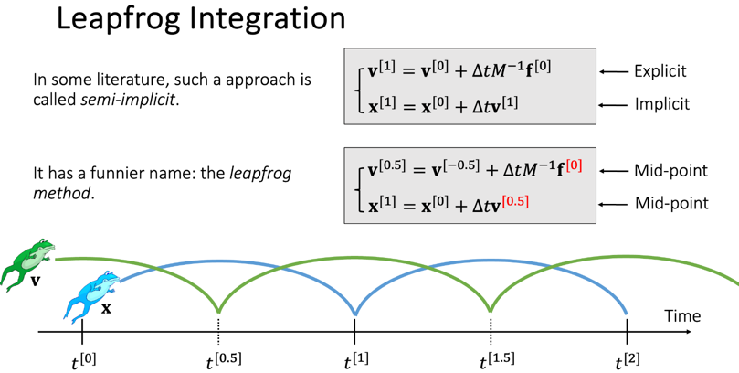

### 1.2.1 Rotational motion

旋转运动由扭矩和转动惯量决定。不同于平移运动中只与力和物体质量的数值有关，扭矩/转动惯量与力/质量在物体上的分布有关。

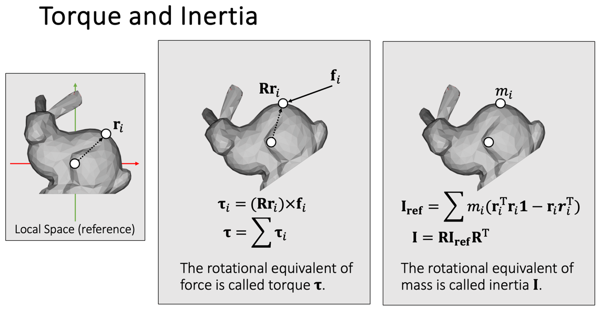

### 1.2.3 Summary

总体上，物体的质量和转动惯量（与物体的质量分布有关）是预先固定的。在模拟过程中设定每个时刻的力与扭矩，就可以不断更新物体的位移（以及速度）和旋转（以及角加速度）。

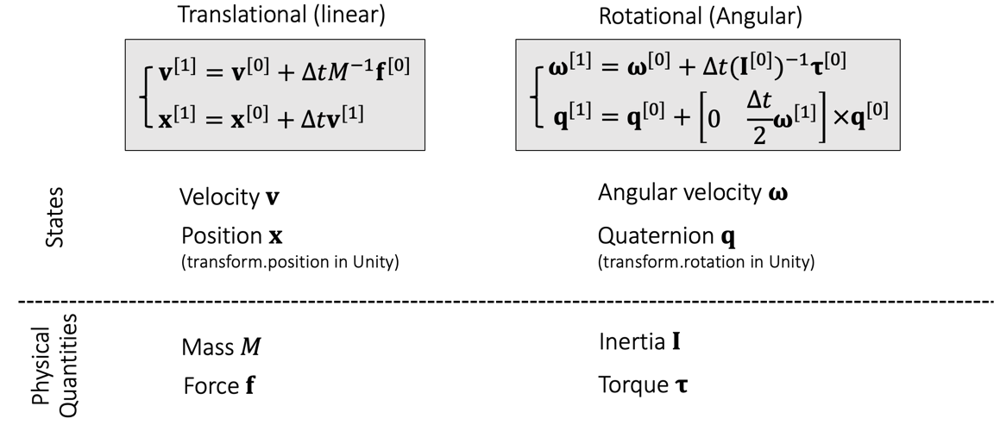

最后总结一下刚体动力学模拟的实现步骤。

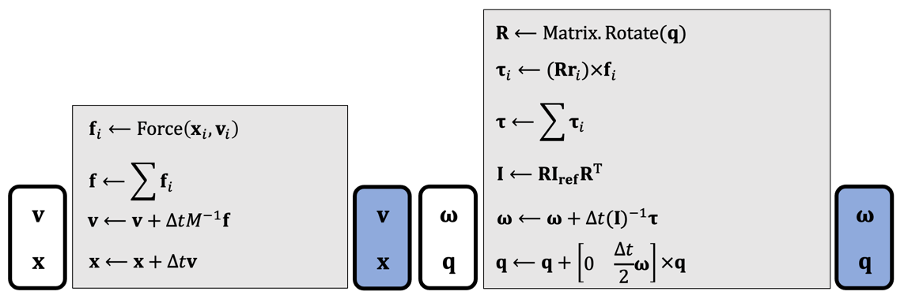

## 1.2 Rigid Body Contacts

### 1.2.1 Penalty method

Penalty方法的核心思想是，检测到物体和碰撞表面overlap之后，根据物体嵌入碰撞表面的深度，施加一个向外的弹力。
为了防止模拟中物体真的嵌入碰撞表面，可以将碰撞表面适当向外扩展出一个缓冲区。

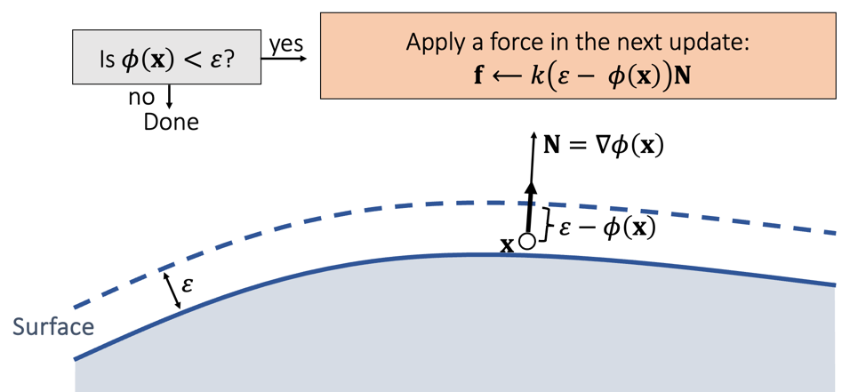

图中的$\phi(x)$指的是物体上的点$x$在碰撞表面的SDF中的取值。

### 1.2.2 Impulse method

Impulse方法的核心思想是，检测到碰撞后直接更新物体的位置和速度，而不是像penalty方法那样间接地先产生一个弹力然后模拟出物体的位置和速度。

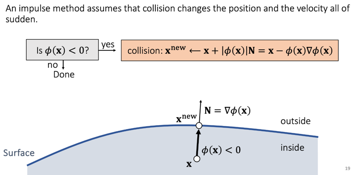

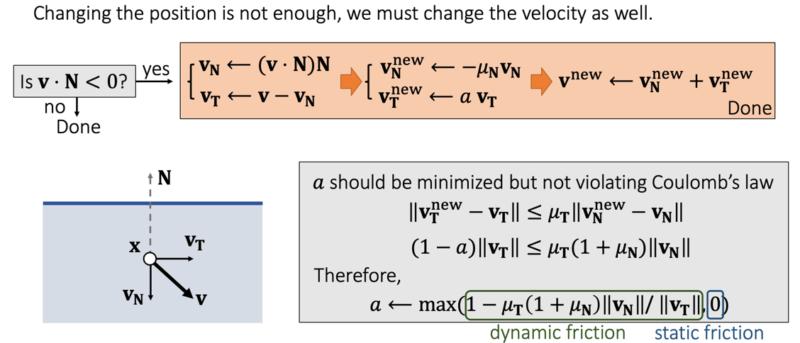

### 1.2.3 Rigid body collision detection and response

对于碰撞检测，简单的做法是将物体的所有顶点都放到碰撞表面的SDF里进行检测。

对于碰撞模拟，上述方法计算的都是物体上碰撞点的局部速度变化，但刚体模拟中，我们需要整个物体的速度。
常用的做法是先计算出碰撞点局部（期望发生的）速度变化，然后计算要产生这些速度变化需要施加在碰撞点局部的力和扭矩，将其施加在刚体上。

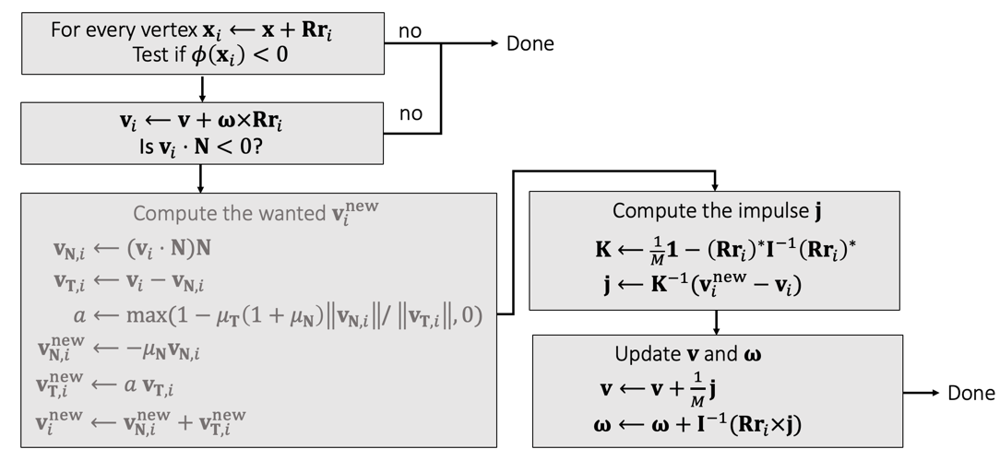

### 1.2.4 Shape matching

Shape matching是一种相比于1.2.3的方法更简化的刚体碰撞模拟方法，无需计算对物体的力和力矩，只对碰撞点局部的速度和位置独立模拟。
各个顶点独立模拟后，物体已经发生了形变，此时再根据各顶点新的位置计算一个rigid transformation，把物体重新约束回一个刚体。

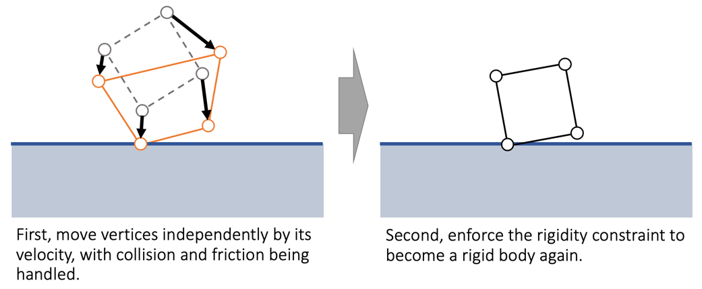

# 2. Cloth 衣物

## 2.1 Mass-Spring System

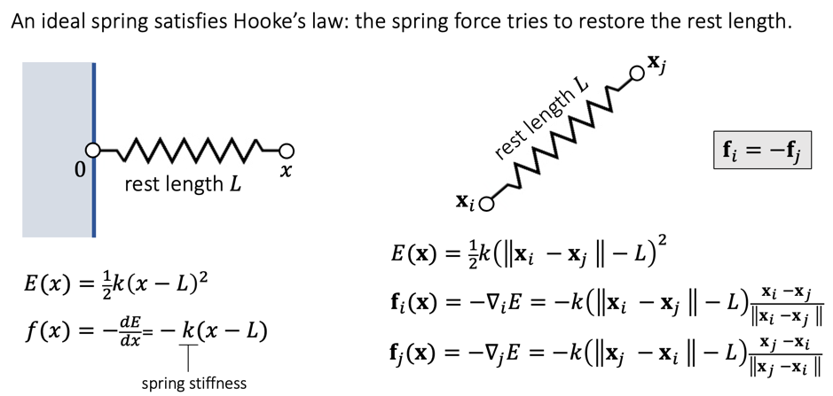

通过组合多个质点并在它们之间连接弹簧，很适合用来模拟衣物。

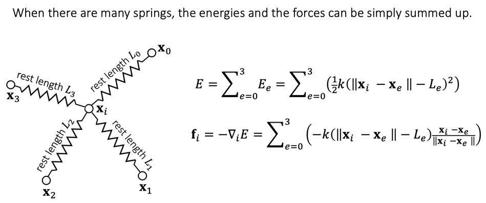

对于整齐排列的矩形网格，我们可以在网格原有的边以及对角线上加入弹簧，来模拟沿各个方向的拉力。
对于三角形排列并不规整的mesh网格，我们也可以直接利用原有的边、并在相邻两个三角形的对角顶点之间连线，作为弹簧。

### 2.1.1 Explicit integration of a mass-spring system 质点弹簧系统的显式积分

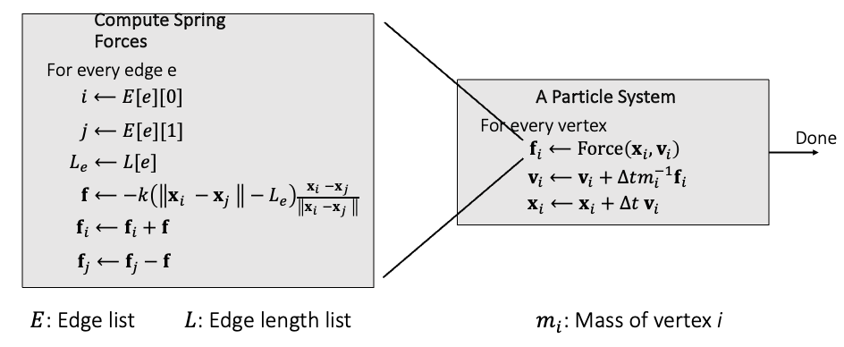

用显式积分的方式直接模拟拉力作用下弹簧的运动非常方便，但显式积分存在数值不稳定问题，特别是在弹性系数$k$或时间间隔$\delta t$取得过大时。

### 2.1.1 Implicit integration of a mass-spring system 质点弹簧系统的隐式积分

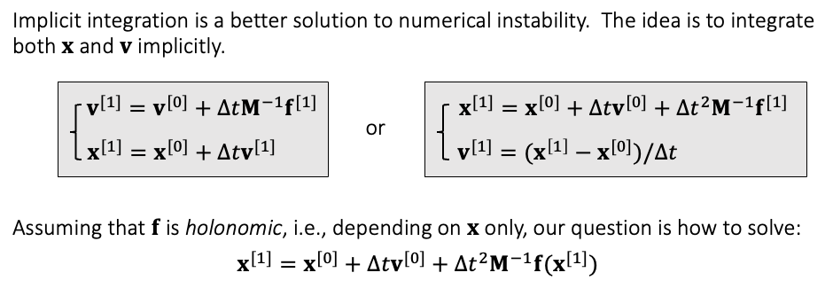

隐式积分有更好的数值稳定，但相比于显式积分简单的前向计算，隐式积分的计算更复杂，需要求解非线性方程。
对方程中未知数$x^{[1]}$的求解，可以用Newton法来迭代计算。

特别地，我们把这个解方程问题转化为对函数$F(x)$的优化问题，因为从求解优化问题的角度，可以直观理解模拟结果中的很多现象。
例如，我们分析目标函数$F(x)$的Hessian矩阵，会发现当弹簧拉长时，Hessian矩阵正定（优化问题有全局最优解）；弹簧缩短时，Hessian矩阵不能保证正定。
直观来看，弹簧拉长时，必然是沿直线拉伸的；而弹簧缩短时则可能向不同方向弯折。