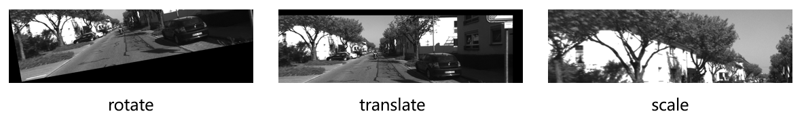
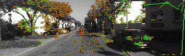
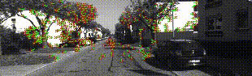

# Demo

* Implement the image warp transform.

* Implement the KLT tracker.

    - Apply KLT tracker to track keypoints in KITTI.
    
    

    - Apply KLT tracker to track keypoints robustly (with bidirectional error check) in KITTI.

    